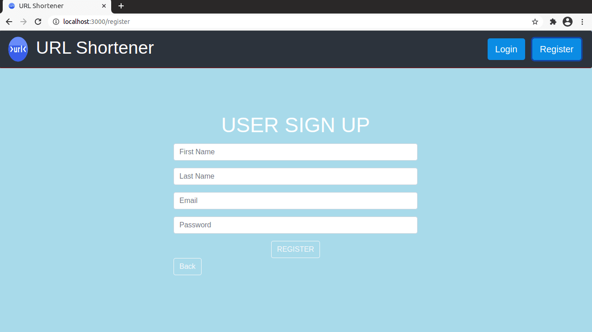
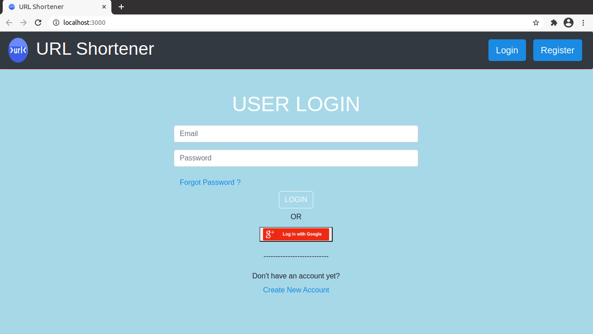
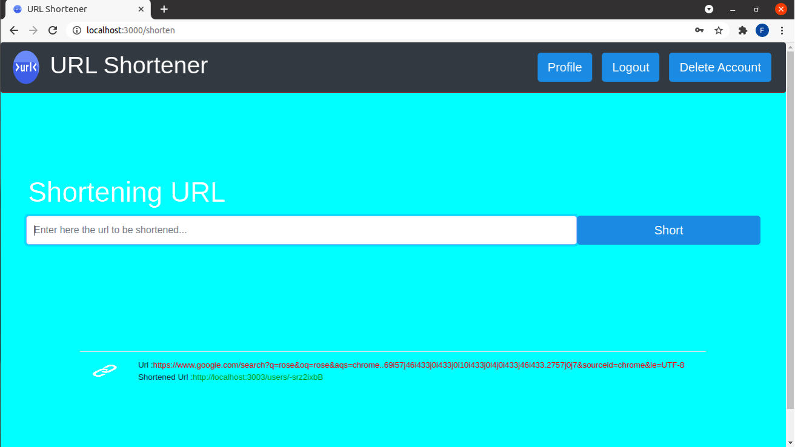
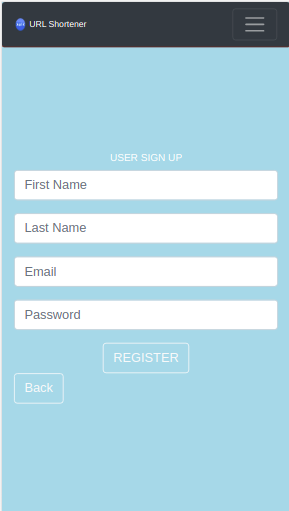
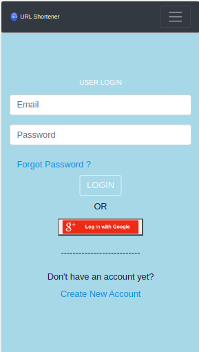
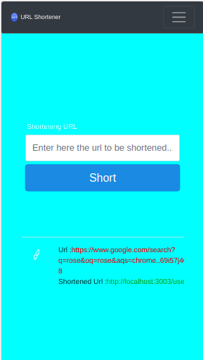

# URL Shortener

 
This application is used to shorten long links. It also allows us to share those shortened links for our usage.
Additionally, we can monitor traffic statistics. 
The Project also works as a Progressive Web App and can be added to Home Screen of our Mobile App.

A Url Shortener built using Node.Js ,React.Js and MongoDb. 
The website has a Login and Signup page with mail id authentication and forgot password feature. It sends mail for authentication and resetting of password, using Nodemailer. The website helps you shorten url and also saves all the url shortened by a user in the database and also displays history of all the shortened url.

## Tools Used:

FrontEnd Tool - ReactJs

BackEnd Tool -  NodeJs  

DataBase - MongoDB 

## Desktop View of Application

## Mobile View of Application

